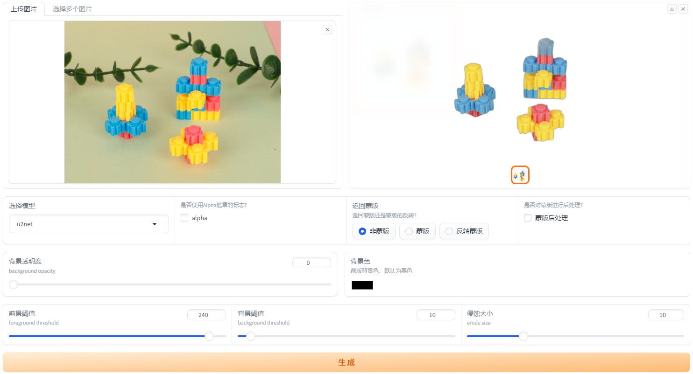

## 1. 简介
这是一个基于Python的Web项目，主要功能是抠图，界面框架使用[`gradio`](https://gradio.app/)库，去除背景的使用[`rembg`](https://github.com/danielgatis/rembg)库。

## 2. Git仓库
[Gitee仓库](https://gitee.com/zyw/rebg)

[Github仓库](https://github.com/zyw/rebg)

## 2. 二次开发
如果需要二次开发，可以参考以下步骤：

1. 安装依赖库：
```
pip install -r requirements.txt
```

2. 运行项目：
```
python main.py
```

3. 打开浏览器，访问`http://localhost:7860/`，即可看到项目的界面。

## 3. 项目图


## 4. 如果电脑显卡性能够，可以使用rembg库的SD插件版本，有更多功能。
https://github.com/AUTOMATIC1111/stable-diffusion-webui-rembg